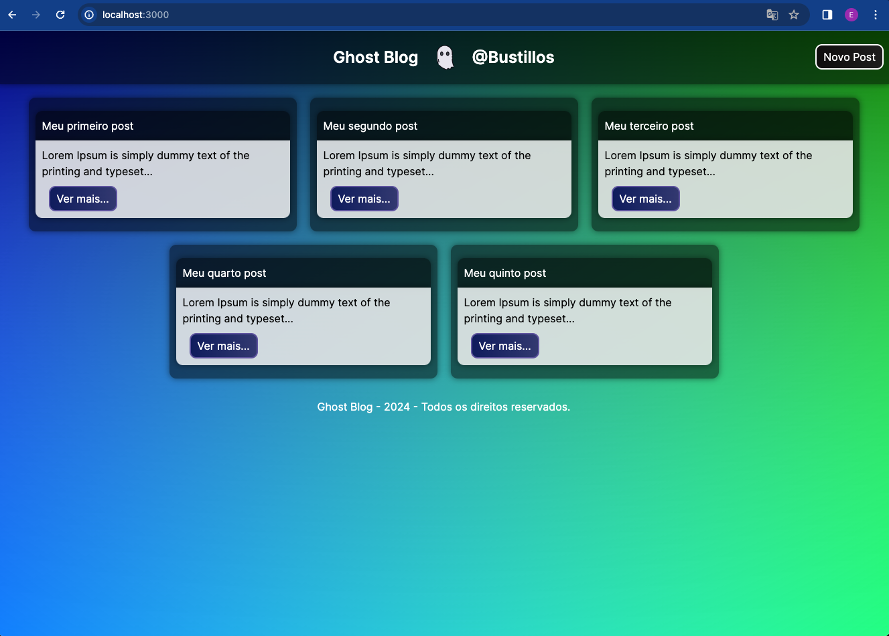
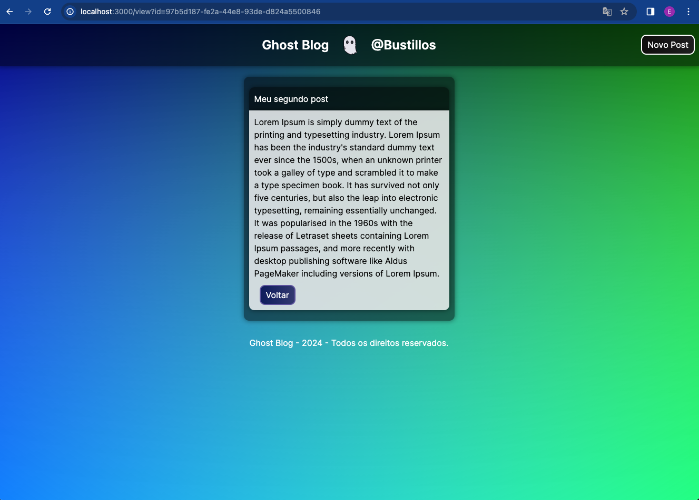
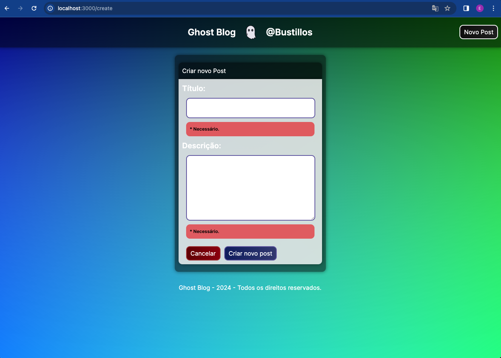

# Ghost Blog
Este é um projeto de blog pessoal chamado "Ghost Blog", criado como parte do desafio do curso de ReactJS e NextJS da Digital Innovation One (DIO).

### Sobre o Projeto
O Ghost Blog é um blog pessoal onde os usuários podem compartilhar suas ideias e pensamentos. O blog suporta a criação, leitura e listagem de posts.

### Screenshots




### Tecnologias Utilizadas
O projeto foi desenvolvido utilizando as seguintes tecnologias:

- Next.js - v14
- React.js - v18
- TypeScript - v5

Supabase - Tabela 'posts' com colunas:
- id : uuid
- title : Text
- description : Text
- body : Text
- created_at : Timestamp


### Como Executar o Projeto
Para executar este projeto localmente, siga estas etapas:

1. Clone o repositório para sua máquina local usando git clone.
```
git clone https://github.com/edwinbustillos/next_blog.git
```
2. Navegue até o diretório do projeto e instale as dependências com npm install ou yarn.
```
npm install
```

Inicie o servidor de desenvolvimento com npm run dev ou yarn dev.
```
npm run dev
```

Abra seu navegador e visite http://localhost:3000 para ver o blog em ação.

### Contribuições
Contribuições são sempre bem-vindas. Sinta-se à vontade para abrir uma issue ou fazer um pull request.

### Contato
Se você tiver alguma dúvida, sinta-se à vontade para entrar em contato.